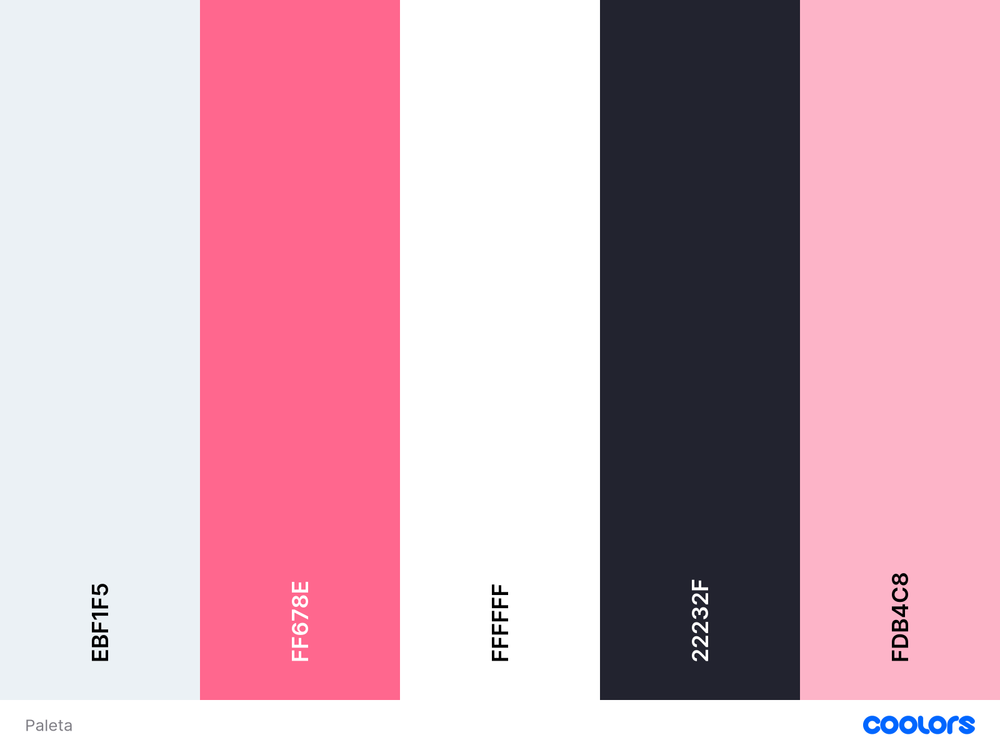
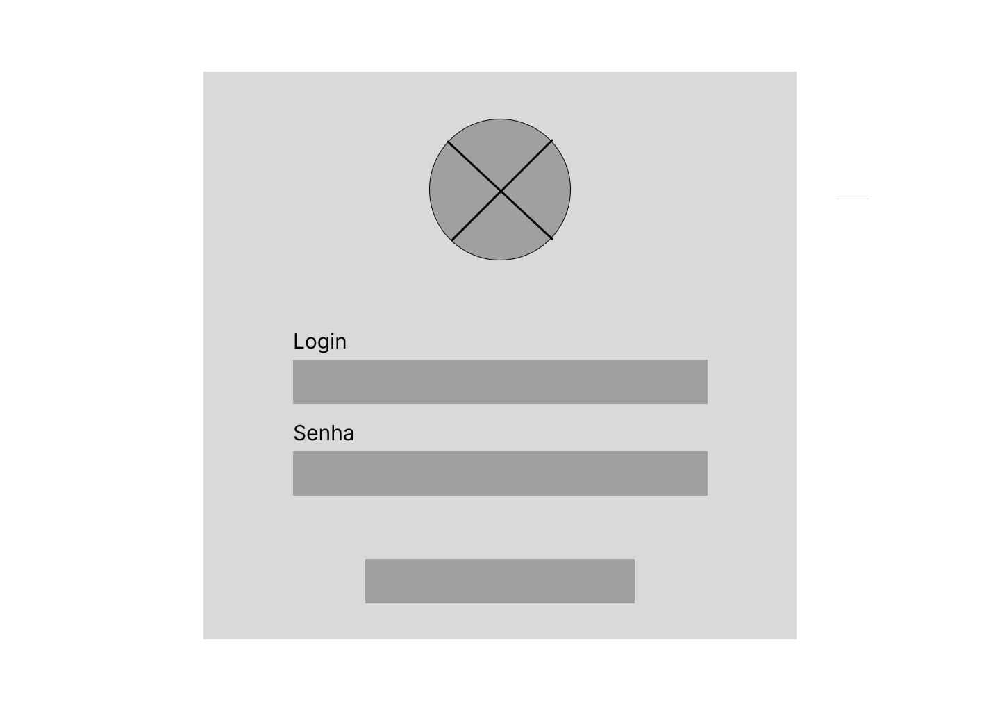
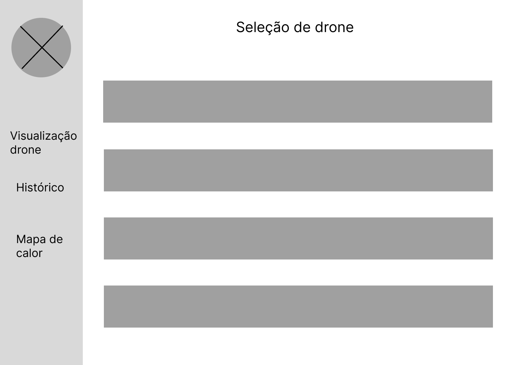
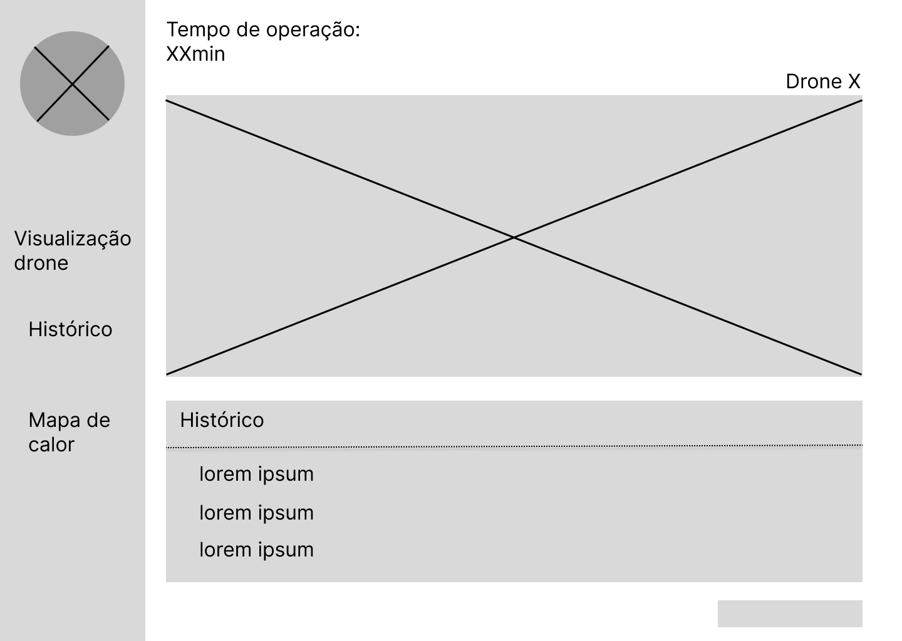
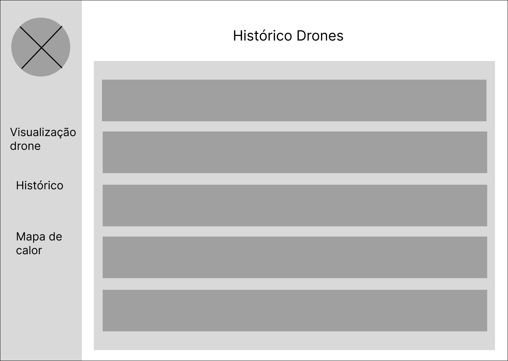
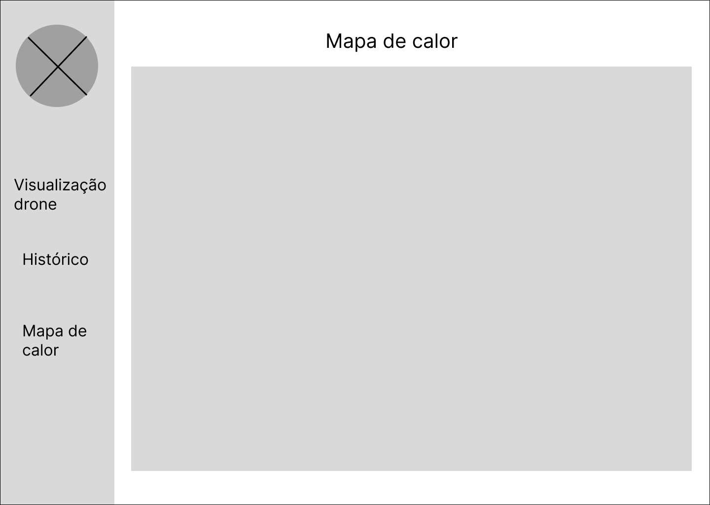
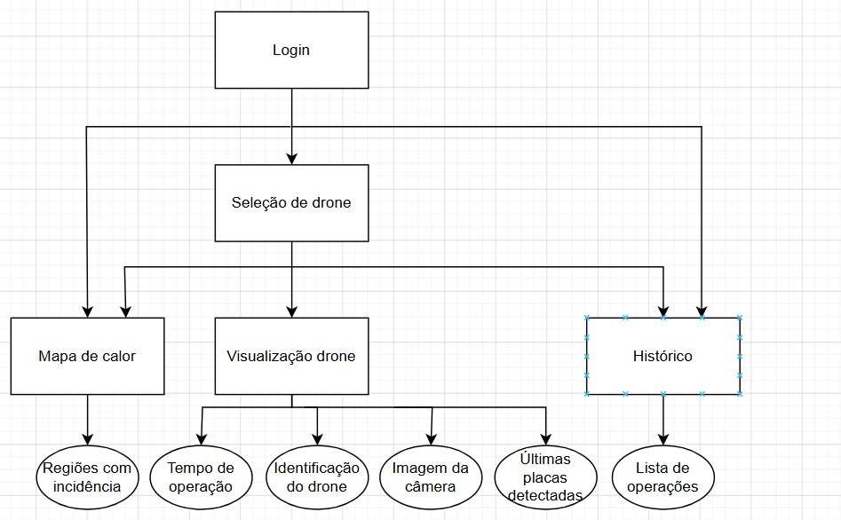
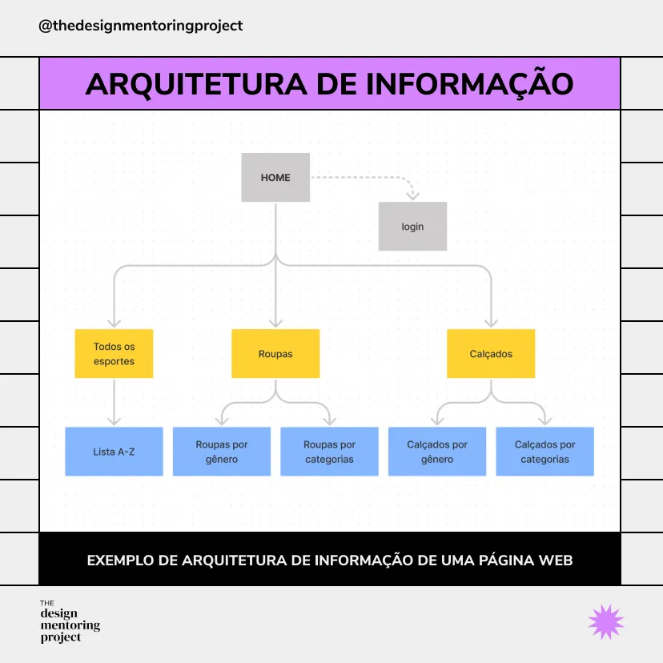

## Personas

&emsp;No contexto desse projeto, as personas permitem uma maior compreensão do público-alvo que queremos atingir com a solução do problema. Elas nos ajudam a identificar quem queremos atingir com o projeto e a delimitar melhor o escopo desse, evitando erros e focando no que realmente vai agregar valor a quem importa: o cliente final. É a partir da análise dessas que conseguimos trazer o projeto para próximo da vida real e assim iniciar sua idealização e produção.

### Persona 1 - Carla Mendes

**cargo:** Analista de sinistros

&emsp;Responsável por acompanhar os casos de roubo e furto de veículos da Pier, é quem coordena as prontas-respostas da empresa e recebe os relatórios de buscas.

&emsp;Suas principais dores giram em volta do fato das operações hoje em dia serem lentas. Quando os sinistros são detectados por câmeras estáticas de terceiros, por exemplo, o processo pode ser lento e a localização do carro pode ser perdida devido a movimentações antes da pronta-resposta chegar no local. Ademais, ela não consegue definir rotas específicas com base em onde existem mais sinistros devido ao processo ser terceirizado.

&emsp;Para isso, Carla deseja que ela tenha acesso à um painel onde ela consiga ver os veículos indicados pelo sistema como roubados/furtados, um histórico de varredura para possíveis consultas e um mapa de calor para identificar as melhores áreas para se fazer as análises.

### Persona 2 - Thiago Barros

**cargo:** Operador de drone

&emsp;Responsável por colocar o drone no ar e garantir que a missão seja executada corretamente, é quem opera o drone em campo durante toda a missão. Seu único recurso durante o voo é a câmera presente no drone, sem acesso a nenhuma interface do sistema.

&emsp;Sua principal dor gira em volta do processo manual de identificação de veículos. Hoje, checar cada placa individualmente durante a operação é lento e limita a quantidade de veículos que consegue cobrir por missão. Para isso, Thiago busca automatizar esse processo por meio da visão computacional, de forma que o sistema identifique e leia as placas automaticamente enquanto ele voa, aumentando sua eficiência e permitindo cobrir uma área significativamente maior em cada operação.

---

## Interface

&emsp;A interface que projetamos para o sistema busca contemplar as dores e necessidades das personas que identificamos no projeto. O objetivo do design pensado é ser prático e informacional, por isso, optamos por uma estrutura simples e concisa, contendo apenas as informações essenciais para cada momento da operação.

&emsp;A paleta de cores foi construída com base na identidade visual da Pier, usando tons de rosé, cinza e branco, com rosa como cor de destaque para informações que precisam de mais atenção. Essa escolha cria uma certa familiaridade visual com a marca, gerando consistência e padrões que são uniformes entre todos os dispositivos da marca. Essa decisão está alinhada com a heurística 4 de Jakob Nielsen que fala a respeito de consistência e padrões, além de reforçar a heurística 1 de que diz respeito a visibilidade do status do sistema, ao utilizar o rosa para evidenciar informações importantes de forma e imediata, facilita o reconhecimento de padrões já conhecidos pelo usuário e permite uma leitura mais rápida das informações críticas tornando a interação mais eficiente.

&emsp;A navegação é organizada em diversas páginas, cada uma com uma função específica. A sidebar foi escolhida como elemento que permite o trânsito entre elas, facilitando a navegação do sistema. Isso é essencial para a Carla, que pode precisar alternar entre todas as telas sem interromper o acompanhamento de uma operação em andamento. Essa separação também resolve diretamente uma das suas dores: agora ela consegue visualizar de forma imediata os carros que foram roubados/furtados e assim aumentar a eficiência da pronta resposta.

&emsp;O fluxo começa pela tela de login, necessária para garantir a segurança do sistema e a integridade das informações.

&emsp;Em seguida, o usuário é direcionado para a tela de emparelhamento, onde escolhe qual drone deseja acompanhar naquela operação. Mesmo sem um drone emparelhado, o mapa de calor permanece acessível, ele é um elemento global da interface porque responde a uma necessidade específica, a de identificar as melhores regiões para direcionar as operações. No entanto, histórico de placas identificadas é vinculado a cada drone individualmente, já que os registros são específicos de cada missão e servem como fonte de consulta e análise para a Carla. Escolhemos essa tela como a inicial do site para garantir que a Carla consiga acessar rapidamente as informações. Por se tratar de uma tela que apresenta dados em tempo real, ela se torna a mais relevante em situações que exigem agilidade na tomada de decisão e por isso deve vir primeiro.

&emsp;Uma vez emparelhado o drone, a tela principal exibe o feed da câmera em tempo real, um botão para encerrar a operação, além de um histórico das últimas placas analisadas pelo sistema e a quanto tempo aquela operação está acontecendo. Todas essas informações vão servir para que Carla consiga tomar as de forma rápida e efetiva. Essa tela responde diretamente à dor central da Carla: o processo atual que depende de câmeras estáticas de terceiros, lentas e com cobertura limitada. Com essa tela, ela passa a ter visibilidade do que está sendo capturado em campo a todo momento.

&emsp;A tela do histórico pode ser acessada a qualquer momento por meio da sidebar, ela é onde a analista consegue visualizar todas as placas identificadas pelos drones em operação. Essa tela garante à Carla uma visão centralizada de tudo que foi capturado durante a operação, permitindo que ela tome decisões com base em informações completas e atualizadas, sem depender de relatórios terceirizados, que é uma das suas principais dores hoje.

&emsp;Outra tela que pode ser acessada a qualquer momento por meio da sidebar é a do mapa de calor. Esse é o principal diferencial da nossa solução, pois é nessa página que a Carla conseguirá visualizar, em formato de mapa de calor, as regiões com maior concentração de ocorrências de carros sinistrados. A função dessa tela é garantir à Carla uma visão geral das operações que acompanha, oferecendo uma base de informações mais sólida para embasar suas decisões.

&emsp;Para situações de erro, um pop-up aparecerá na tela descrevendo o problema e orientando o usuário sobre como proceder, garantindo que falhas sejam comunicadas de forma clara.

## Arquitetura da Informação

&emsp;O diagrama de arquitetura da informação foi desenvolvido a partir das diretrizes definidas no projeto de interface, que prioriza simplicidade, clareza e acesso rápido às informações mais relevantes para a operação. Considerando o objetivo da plataforma de apoiar a tomada de decisão em tempo real, a estrutura foi organizada de forma hierárquica, destacando os principais blocos de informação e suas relações. O fluxo se inicia no acesso ao sistema (login) e na seleção do drone, etapa que define o contexto da operação, a partir do qual as demais informações são organizadas.

 Diagrama de arquitetura da informação da plataforma, representando a organização hierárquica dos conteúdos e suas relações.

&emsp;A partir desse contexto, o diagrama evidencia três núcleos principais de informação: a visualização da operação em tempo real, o histórico de dados coletados e o mapa de calor. A visualização concentra as informações operacionais críticas para o acompanhamento da operação, atendendo à necessidade de agilidade e monitoramento contínuo. O histórico organiza os registros gerados ao longo das operações, estando associado aos dados coletados pelos drones, permitindo consulta e análise posterior. Já o mapa de calor se apresenta como um elemento independente dentro da arquitetura, pois atende a uma necessidade estratégica de análise espacial, não estando vinculado a um contexto específico de operação.

&emsp;Essa organização reflete diretamente as decisões de design descritas anteriormente, como a priorização de informações essenciais em cada etapa e a redução de complexidade na navegação. Ao estruturar os conteúdos em blocos bem definidos e relacioná-los ao contexto de uso, o diagrama reforça a proposta de uma interface prática e informacional, garantindo acesso rápido tanto a dados em tempo real quanto a informações históricas e analíticas.

&emsp;Como referência para a construção do diagrama, foi utilizada uma imagem de arquitetura da informação disponível no artigo “Qual a diferença entre Arquitetura de Informação (AI), User Flow e Site Map?”, publicado na plataforma UX Collective Brasil. Essa referência auxiliou na definição da organização hierárquica dos elementos e na forma de representação visual adotada.

Referência de arquitetura da informação utilizada como base para a construção do diagrama.

UX Collective Brasil. Qual a diferença entre Arquitetura de Informação (AI), User Flow e Site Map?. Disponível em: https://brasil.uxdesign.cc/qual-a-diferen%C3%A7a-entre-arquitetura-de-informa%C3%A7%C3%A3o-ai-user-flow-e-site-map-b9d6c7461dee. Acesso em: 01 maio 2026. 
