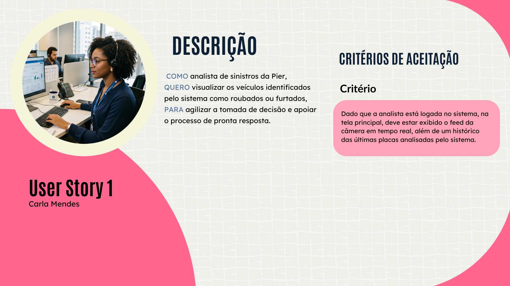
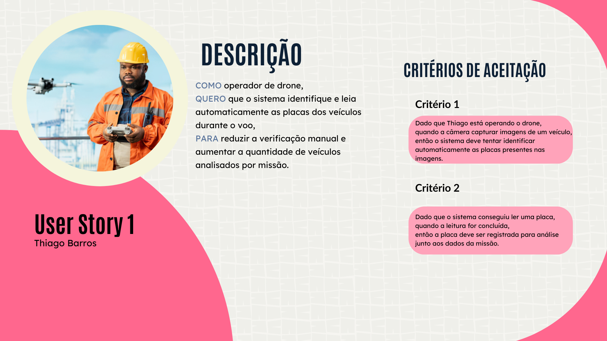

# User Stories
 
## 1. Introdução às User Stories
 
User Stories, ou Histórias de Usuário, são artefatos fundamentais na metodologia ágil de desenvolvimento de software. Seu principal objetivo pode ser resumido em uma única palavra: comunicar. Elas funcionam como um canal estruturado entre o cliente e o time de desenvolvimento e transmitem a visão do produto de forma clara e centrada em quem realmente vai usar o sistema.
 
Ao contrário de documentos de requisitos tradicionais, as User Stories são intencionalmente curtas e escritas em linguagem natural. Elas não descrevem como algo deve ser feito tecnicamente, mas sim o que o usuário precisa e por quê.
 
### 1.1 Origem e Contexto Histórico
 
O conceito de User Story surgiu no final dos anos 1990, no contexto do Extreme Programming (XP), metodologia ágil criada por Kent Beck. A proposta era substituir especificações funcionais longas por descrições simples que iniciavam uma conversa, mas não que a substituíam.
 
Com a popularização do Scrum nos anos 2000, tornaram-se o principal mecanismo de gestão de backlog em times de produto ao redor do mundo.
 
### 1.2 Estrutura de uma User Story
 
Uma User Story bem escrita é composta por dois elementos centrais, que juntos garantem que o time entenda o que precisa ser construído e como validar que foi construído corretamente:
 
- **Descrição:** define a persona, a funcionalidade desejada e o objetivo ou problema a ser resolvido;
- **Critérios de Aceitação:** condições objetivas e verificáveis que a funcionalidade deve satisfazer para ser considerada concluída e aceita pelo cliente.
Além desses dois pilares, boas práticas indicam a inclusão de contextualização e wireframes como referência visual durante o refinamento.
 
### 1.3 O que são Critérios de Aceitação?
 
Os Critérios de Aceitação são as condições que uma funcionalidade deve atender para ser aceita pelo cliente ou usuário. Esses critérios nascem das regras de negócio, das definições de experiência do usuário (UX), de requisitos de acessibilidade e devem incluir tudo que seja relevante para o time dado um determinado cenário.Os Critérios de Aceitação não descrevem como o sistema deve ser implementado tecnicamente, mas descrevem o comportamento esperado do sistema do ponto de vista do usuário.
 
## 2. User Story 1 — Visualização de Veículos Suspeitos

*Figura 1. User story da Persona Carla Mendes*

*Fonte: produzido pelo grupo*

### 2.3 Descrição da História
 
As descrições das histórias foram estruturadas no padrão role-feature-benefit, que define quem é o usuário, o que ele precisa e qual o valor que essa funcionalidade entrega em um mesmo texto:
 
> Como analista de sinistros da Pier, quero visualizar os veículos identificados pelo sistema como roubados ou furtados, para agilizar a tomada de decisão e apoiar o processo de pronta resposta.
 
### 2.4 Critérios de Aceitação
 
Os Critérios de Aceitação desta User Story definem as condições mínimas que o sistema deve atender para que a funcionalidade seja considerada completa e validada. Para esta história, definimos dois cenários distintos para ser cobertos: o acesso ao painel principal e o fluxo de criação de conta para novos usuários. Ambos são pré-requisitos para que a nossa persona consiga utilizar o sistema de forma autônoma.
 
#### Critério 1 — Acesso ao feed e histórico de placas na tela principal
 
Este critério garante que, ao acessar o sistema, a analista visualize imediatamente as informações operacionais mais críticas: o monitoramento em tempo real e o registro das últimas placas analisadas.
 
> Dado que a analista Carla Mendes está logada no sistema, quando ela acessar a tela principal, então deve estar exibido tanto o feed da câmera em tempo real quanto um histórico das últimas placas analisadas pelo sistema.
 
#### Critério 2 — Criação de conta com e-mail empresarial
 
Este critério trata do fluxo de onboarding de novos usuários da plataforma. Para que Carla possa acessar o sistema pela primeira vez, é necessário que o processo de criação de conta funcione corretamente.
 
> Dado que Carla ainda não possui uma conta na plataforma, quando ela informar seu e-mail empresarial e definir uma senha válida, então o sistema deve permitir a criação da conta e liberar o acesso à plataforma.
 
## 3. User Story 2 — Leitura Automática de Placas por Drone

*Figura 1. User story da Persona Thiago Barros*

*Fonte: produzido pelo grupo*
 
### 3.3 Descrição da História
 
Na segunda User Story, evidencia-se o papel do operador, a funcionalidade solicitada e o benefício direto que ela gera para o processo de monitoramento:
 
> Como operador de drone, quero que o sistema identifique e leia automaticamente as placas dos veículos durante o voo, para reduzir a verificação manual e aumentar a quantidade de veículos analisados por missão.
 
### 3.4 Critérios de Aceitação
 
Nos critérios de avaliação da segunda User Story, o primeiro garante que o sistema tente processar todas as imagens recebidas da câmera do drone, e o segundo garante que, quando a leitura é bem-sucedida, a informação é preservada e vinculada à missão correspondente. Juntos, eles cobrem o fluxo principal desta funcionalidade de ponta a ponta.
 
#### Critério — Identificação automática de placa a partir das imagens do drone
 
Este critério estabelece que o sistema deve processar automaticamente cada imagem capturada pela câmera do drone em busca de placas veiculares. Essa é a etapa de entrada do fluxo de leitura:
 
> Dado que Thiago Barros está operando o drone em missão, quando a câmera capturar imagens de um veículo, então o sistema deve tentar identificar automaticamente as placas presentes nas imagens capturadas.

## 4. Referências
 
BECK, Kent. **Extreme Programming Explained: Embrace Change**. Boston: Addison-Wesley, 1999.
 
BECK, Kent et al. **Manifesto para Desenvolvimento Ágil de Software**. 2001. Disponível em: https://agilemanifesto.org. Acesso em: 10 maio 2026.
 
NORTH, Dan. **Introducing BDD**. 2006. Disponível em: https://dannorth.net. Acesso em: 10 maio 2026.
 
SCARIOT, Ana Paula. **User Stories: boas práticas, estruturação e dicas extras**. 2023. Disponível em: https://blog.cwi.com.br. Acesso em: 10 maio 2026.